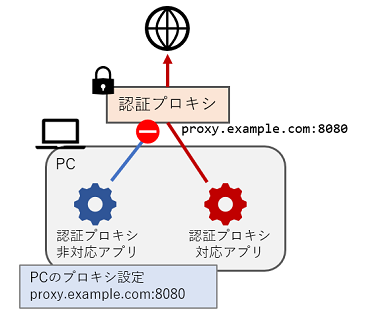

[目次](Index.md)

---

# 概要

「認証プロキシ爆発しろ！」（英語名 MAPE: May Authentication Proxy Explode）は、
認証プロキシに対する苛立ちや呪詛の思いによって心が濁ることをソフトウェア的になんとか防ぐためのツールです。

これは認証プロキシを回避するものでは**ありません**。
認証プロキシに対応していないソフトウェアのhttp/https通信を中継して、
正しく認証プロキシを通すようにするものです。

なお、「認証プロキシ爆発しろ！」という名前は、
認証プロキシのために環境設定がうまくいかずに荒ぶる心の叫びをそのまま名前にしたものであり、
何かに対する悪意を表現しているわけではありません。

## 機能

このツールは認証プロキシに対するプロキシとして機能します。
認証プロキシが認証を要求した場合、
発信元のソフトウェアにまで戻ることなく、
このツールが認証情報を追加して、
リクエストを認証プロキシに対して再送信します。
結果として、
認証プロキシ**非対応**ソフトウェアが認証プロキシ環境内で動作できるようになります。

ただし、
このツールはプロキシのように動作するものなので、
元々プロキシにまったく対応していないソフトウェアには効果がありません。

Windowsデスクトップで実行した場合、
このツールは、
通信の中継を開始する際に、
ユーザーのプロキシ設定を自動的に書き換え、
このツールがユーザーの指定プロキシとなるようにします。
通信の中継を停止する際に、
書き換えた設定を元に戻します。

  

## 効能

* 認証プロキシ環境内で認証プロキシ非対応ソフトウェアを利用することができます。
* 認証プロキシのパスワードをあちこちの設定ファイルに埋め込まなくてすみます。
パスワードは暗号化された状態で設定ファイル一箇所にあれば十分です。
（まあ、元々認証プロキシのパスワードはあんまり安全でないやり方でやりとりされますので、気休めではありますが）
* 仮想化ソフトウェア（Hyper-Vなど）が定義したマシン内ネットワークに対する（通常）プロキシとして利用できます。
これを利用すると、
「プロキシの設定を埋め込んだままのイメージを公開してしまった！」という事故をやらかしても多少状況はましになります
（パスワードが埋め込まれないから）。
